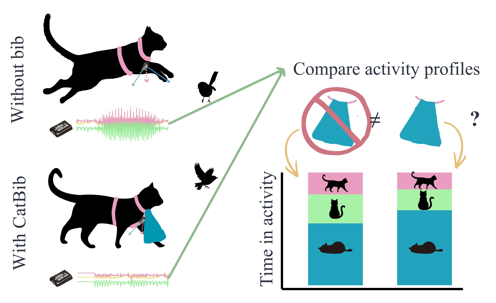

# Effect of CatBib on behaviour of domestic cats
Determining the effect of the anti-predation "CatBib" on the behavioural profiles of free-roaming domestic cats. The following workflow develops a basic behavioural classifier, categorises behaviour in free-roaming individuals, and then quantifies the effect of the bib. Continuation of [earlier paper](https://www.nature.com/articles/s41598-021-92896-4). 



## Data
Free-roaming data was collected in 2019 by Nicole Galea. Labelled data was collected by me in 2024. Will be made available when I find somewhere free and stable to upload it.

## Workflow
### Folder Structure
```
CatPaper/
├── Scripts/
│ └── Matlab/ (for labelling the data)
│ └── BuildingModel/ (scripts for generating the ML models)
│ └── GeneratingPredictions/ (scripts for predicting onto unlabelled data)
│ └── UnderstandingEcology/  (scripts for comparing the bib conditions)
│ └── General scripts for other things (functions, plots, etc)
├── Data/
│ └── LabelledData/ (training data from various sources)
│ └── RawData/ (unedited, unlabelled csvs from the study)
│ └── CatInfo.csv (collaring schedule)
├── Output/
│ └── ModelBuilding/ (all outputs associated with making the models)
│   └── TemporaryData/ (iterative saves of the processing data)
│ └── Predictions/ (all outputs associated with making predictions on unlabelled data)
│   └── TemporaryData/ (iterative saves of the processing data)
│ └── UnderstandingEcology/ (results of the bib condition)
└── Manuscript/
  └── Figures/ (graphs and plots)
  ```

### How the Script Works
1. Generate labelled data using the Matlab GUI to align video and accelerometer data streams.
2. Convert this labelled data into feature data and use to train a basic behavioural classifier.
3. Convert the unlabelled data to feature data as well. 
4. Apply the models to the unlabelled data to generate predictions.
5. Compare bib conditions.

## Acknowledgements 
Project was conceptualised by Chris Clemente. Unlabelled data collected by Nicole Galea in 2019. New data and all analysis conducted by Oakleigh Wilson (me) with stats guidance from Dave Schoeman. Write up by me with support from Jasmin Annett.
